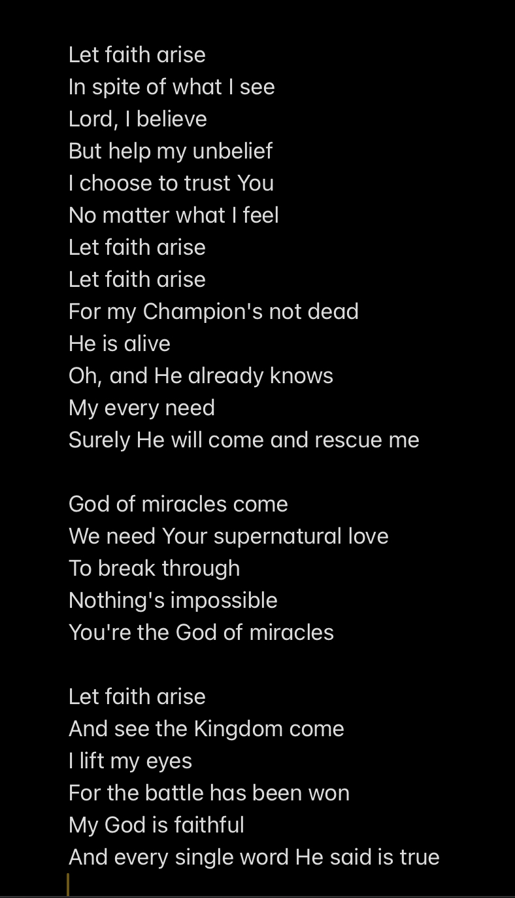

The purpose of this blog is to demonstrate that the most satisfying life is one surrendered in love to something worthy of the sacrifice.  In this first post, we will consider the role of beliefs and love.  A pattern of self-denial emerges in each but the act of surrender is rewarded.  The irony is that one can experience both an ongoing self-denial in this world and the reward of joy as we lean into faith and love.  It is my belief that this surrender defines love; and then all that remains is the mystery of the greatest love, that which is worthy of our indulgent life of sacrifice.

If none of that first paragraph made any sense to you, then consider yourself in good company.  This concept of surrender is not straight-forward, it seems to me both a mystery and at the same time the most obvious epiphany.  This must be one of those moments when you realize how ignorant you really are, is this obvious to everyone but me?

When we look up at the stars and experience the awe of grandeur, we feel small and at the same time a desire to give ourselves to the greatness before us.  Let me be transformed to enter into the amazing beauty of nature.  Is it a useless dream, to encounter this side of ourselves, to experience a calling for purpose and meaning.

Some turn away from these moments and dismiss them as delusions that have no role to play in the fulfillment of their lives.  Perhaps we are deluded by love and faith.  Perhaps there is nothing to live for that is greater than ourselves.  At this fork in the road, the challenge is to lay down pride for the sake of joy.  The life of the cynic is withdrawn, reducing all around him to nothing, black and white sterility.  Stop that, enjoy life.  There are only two choices, and one is better.  Have hope, look for love.

There are ideals that many of us hold dear: family, love, freedom, justice, pursuit of happiness, responsibility for our world.  Are these overrated dreams, nothing more than selfish instincts, or do they transcend culture that we might bow our lives to them.  These dreams of beauty and love are evidence against simple survival.  We cannot throw away our hope, we must experience the wonder-filled world.  We must dream more, not less.  Believe in things that overwhelm your passions, and they will lead you to something greater.  Give yourself to them, be caught up in the storm.

