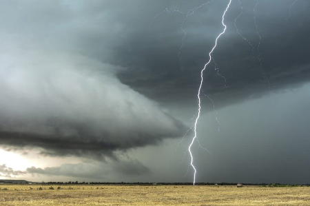

The purpose of this blog is to demonstrate that the most satisfying life is one surrendered in love to something worthy of the sacrifice.  As we consider the purpose of belief and love, a pattern of self-denial emerges in each and surrender is rewarded.  The irony is that we can experience both the reward of joy and at the same time an ongoing denial of self.  Is it possible to be selfishly selfless?  This surrendering of life defines love; and then all that remains is to find that which is worthy of our indulgent life of sacrifice.

What are you living for?  There are ideals which many of us hold dear: family, love, freedom, justice, pursuit of happiness, responsibility for our world.  Are these overrated, nothing more than selfish instincts, or do they transcend culture that we might devote ourselves to them?  When we look up at the stars and experience awe and grandeur, we feel small; and at the same time a desire to become a part of the greatness before us.  Is it a useless dream, to encounter this side of ourselves, to experience a calling for purpose and meaning.  Perhaps there is nothing to live for that is greater than ourselves?  The life of the cynic is withdrawn, reducing all around him to nothing, black and white sterility.  Stop that, enjoy life.  We cannot throw away our hope, we must experience the wonder-filled world.  We must dream more, not less.  Believe in things that overwhelm your passions, and they will lead you to something greater.  Be caught up in the storm.

